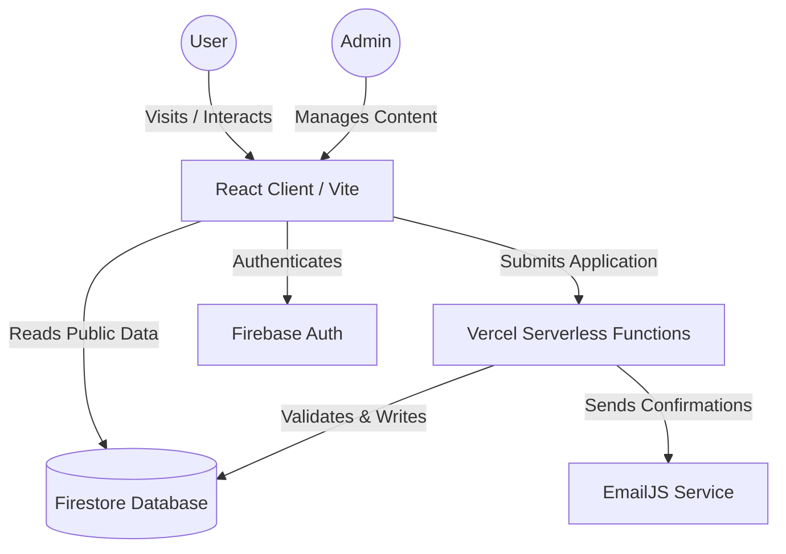

# LOOP - GCET Official Technical Club Website


Welcome to the official repository for **LOOP**, the futuristic, high-performance platform for the technical club of Galgotias College of Engineering and Technology (GCET).

This project features a modern, dark-themed UI with neon aesthetics, advanced animations, and a secure internal admin panel for club management.

## 🚀 Features

### Public Website
- **Futuristic UI**: Customized dark theme with neon cyan/violet accents, glassmorphism effects, and dynamic 3D backgrounds.
- **Interactive Home Page**: 
    - **3D Particle System**: Interactive background reacting to mouse movement.
    - **Credibility Strip**: Live counters for members and events.
    - **"About System" HUD**: Sci-fi inspired layout.
- **Team Section**: Detailed profile cards with hover reveals and social connections.
- **Events & Registration**: 
    - Real-time event timeline.
    - **Instant Registration**: Seamless public registration for club events.
- **Join Us (Membership)**: 
    - Comprehensive application form with automated validation.
    - Status tracking system.
- **Leaderboard**: Real-time ranking system for the top competitive programmers.
- **Chatbot (LOOP Assistant)**: 
    - **Smart Responses**: Replies with "Rich Cards" (Events, Profiles) instead of just text.
    - **Quick Actions**: One-tap suggestions for common queries.
    - **Interactive**: Fully transparent UI with intelligent context awareness.
- **Mobile Responsive**: Fully optimized for all devices with touch-friendly interactions.

### Admin Panel (Secure)
- **Dashboard**: Specialized command center for club leads.
- **Authentication**: Role-based access via Firebase.
- **Live Event Management**: Create, edit, and toggle event registrations instantly.
- **Membership Hub**: 
    - Real-time application review (Approve/Reject).
    - Detailed candidate profiles (GitHub stats, etc.).
- **Message Center**: 
    - **Inquiry Management**: Centralized view for contact form submissions.
    - **Smart Filtering**: Rapidly sort and address queries.
- **Google Sheets Integration**:
    - **Two-Way Sync**: Automatically adds new applications to a Google Sheet.
    - **Status Sync**: Updates specific rows when application status changes.
    - **Deletion Sync**: Removes entries from the Sheet when deleted from the Admin Panel.

## 🎨 Visuals & Aesthetics

LOOP sets a new standard for club websites with its focus on visual immersion:

- **3D Particle Engine**: A custom-built, lightweight particle system that provides depth and motion.
- **Glassmorphism**: Extensive use of backdrop filters and translucent layers to create hierarchy.
- **Neon Typography**: Glowing text elements that reinforce the futuristic cyber-tech theme.
- **Motion Design**: Smooth transitions and entry animations powered by `framer-motion`.

<!-- 
Add screenshots here:
 

-->

## 🏗️ Architecture

The system utilizes a hybrid architecture leveraging React for the frontend and Serverless functions for secure backend operations.



## 🛠️ Tech Stack

- **Frontend**: React 18, Vite, TailwindCSS (for utility), Vanilla CSS (for custom effects).
- **Styling**: Framer Motion (Animations), Lucide React (Icons).
- **Backend**: 
    - **Vercel Serverless Functions**: Secure API endpoints for sensitive logic.
    - **Firebase Authentication**: Identity management.
    - **Firebase Firestore**: Real-time NoSQL database.
- **Services**: 
    - **EmailJS**: Transactional email delivery.
    - **Google Apps Script**: Custom script for Sheets integration.

## 🗄️ Database & Schema

For a detailed overview of the Firestore Cloud Database architecture, collections strategy, and security rules, please refer to the [DATABASE_SCHEMA.md](DATABASE_SCHEMA.md).

## 📂 Project Structure

```bash
src/
├── components/     # UI Building Blocks (Navbar, Cards, Particles)
├── contexts/       # Global State (AuthContext)
├── layouts/        # Page Wrappers (AdminLayout, PublicLayout)
├── pages/          # Application Routes
│   ├── admin/      # Secure Management Views
│   └── public/     # Visitor Pages (Home, Team, Events)
├── api/            # Serverless Backend Functions
└── assets/         # Images and Static Resources
└── GOOGLE_SHEETS_SCRIPT.js # Google Apps Script for Sync
```

## ⚡ Getting Started

### Prerequisites
- Node.js (v18+)
- Firebase Project Credentials
- EmailJS Account

### Installation

1.  **Clone the repository:**
    ```bash
    git clone https://github.com/your-username/loop-website.git
    cd loop-website
    ```

2.  **Install dependencies:**
    ```bash
    npm install
    ```

3.  **Configure Environment Variables:**
    Create a `.env` file in the root directory.

    **Client-Side (Vite):**
    ```env
    VITE_FIREBASE_API_KEY=your_key
    VITE_FIREBASE_AUTH_DOMAIN=your_domain
    VITE_FIREBASE_PROJECT_ID=your_id
    # ... other firebase config
    ```

    **Server-Side (Local Development):**
    ```env
    FIREBASE_SERVICE_ACCOUNT={"type":"service_account",...}
    EMAILJS_SERVICE_ID=your_service_id
    EMAILJS_TEMPLATE_ID=your_template_id
    EMAILJS_PUBLIC_KEY=your_public_key
    EMAILJS_PRIVATE_KEY=your_private_key
    ```

4.  **Run Development Server:**
    ```bash
    npm run dev
    ```
    *Note: To test serverless functions locally, use `vercel dev` if configured.*

5.  **Grant Admin Access (Optional):**
    To enable admin privileges for a user, update the email in `setAdmin.js` and run:
    ```bash
    node setAdmin.js
    ```
 
*Built with 💻 and ☕ by the LOOP Team.*
